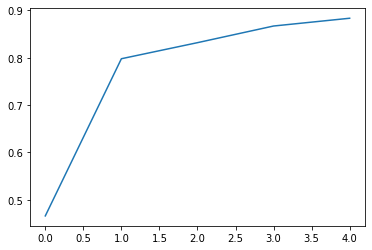
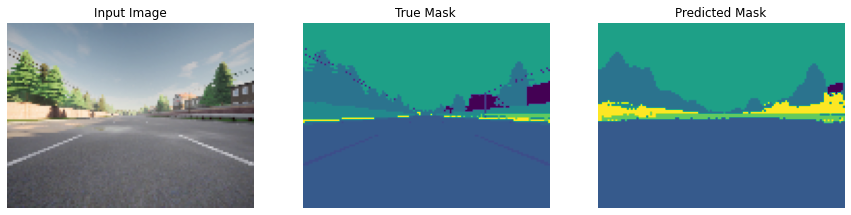

# Self-Driving Cars Image Segmentation with U-Net

This project focuses on semantic image segmentation for self-driving cars using the U-Net architecture. The goal is to segment different parts of the driving environment, such as roads, vehicles, pedestrians, and other relevant objects, to help self-driving cars understand their surroundings.

### U-Net Architecture

U-Net is a convolutional neural network architecture designed for precise segmentation tasks. It consists of two main parts:

- **Encoder (Contracting Path):** This part captures context by progressively downsampling the input image while increasing the number of feature channels. It extracts high-level features at different scales.
  
- **Decoder (Expanding Path):** This part performs upsampling and combines the high-resolution features from the encoder through skip connections. It produces a segmented output that aligns with the input image resolution.

### Dataset

The dataset used in this project includes images captured from a self-driving car's perspective, annotated with pixel-level labels. The dataset is called **CARLA** and hosted on kaggle.

### Example Output
#### Accuracy over the epochs

#### Segmented Image

